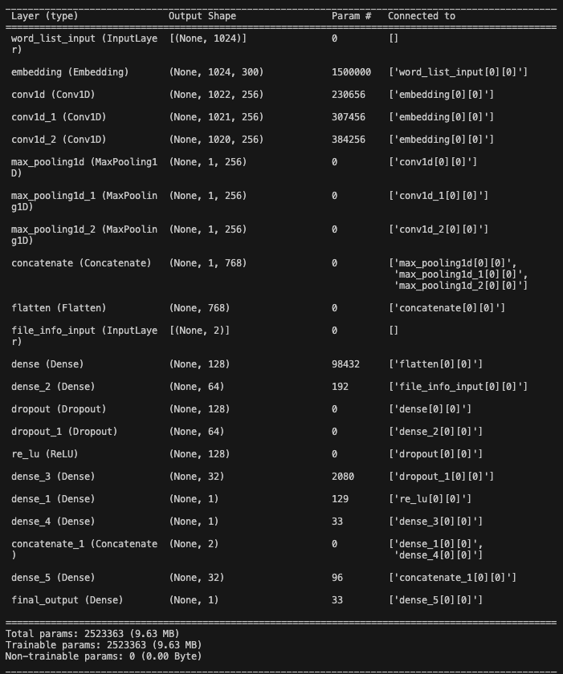
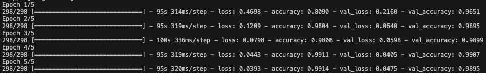
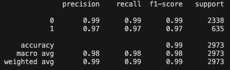

# WebshellCNN
Webshell作为黑客惯用的入侵工具，是以php、asp、jsp、perl、cgi、py等网页文件形式存在的一种命令执行环境。黑客在入侵一个网站服务器后，通常会将webshell后门文件与网站服务器WEB目录下正常网页文件混在一起，通过Web访问webshell后门进行文件上传下载、访问数据库、系统命令调用等各种高危操作，达到非法控制网站服务器的目的，具备威胁程度高，隐蔽性极强等特点。

本仓库尝试通过一个 TextCNN + 二分类网络合成的综合深度神经网络实现对于 Webshell 的静态检测。TextCNN 用于处理向量化后的词数组，二分类网络用于处理手动提取的数字化特征（文件的大小以及熵值等等）。

## Datasets
原始数据集采集自 [Github](https://github.com)，下面是详细的仓库列表.

### 黑样本
1. [tennc/webshell](https://github.com/tennc/webshell)
2. [JohnTroony/php-webshells](https://github.com/JohnTroony/php-webshells)
3. [xl7dev/webshell](https://github.com/xl7dev/webshell)
4. [tutorial0/webshell](https://github.com/tutorial0/webshell)
5. [bartblaze/PHP-backdoors](https://github.com/bartblaze/PHP-backdoors)
6. [BlackArch/webshells](https://github.com/BlackArch/webshells)
7. [nikicat/web-malware-collection](https://github.com/nikicat/web-malware-collection)
8. [fuzzdb-project/fuzzdb](https://github.com/fuzzdb-project/fuzzdb)
9. [lcatro/PHP-webshell-Bypass-WAF](https://github.com/lcatro/PHP-webshell-Bypass-WAF)
10. [linuxsec/indoxploit-shell](https://github.com/linuxsec/indoxploit-shell)
11. [b374k/b374k](https://github.com/b374k/b374k)
12. [LuciferoO/webshell-collector](https://github.com/LuciferoO/webshell-collector)
13. [tanjiti/webshell-Sample](https://github.com/tanjiti/webshell-Sample)
14. [JoyChou93/webshell](https://github.com/JoyChou93/webshell)
15. [webshellpub/awsome-webshell](https://github.com/webshellpub/awsome-webshell)
16. [xypiie/webshell](https://github.com/xypiie/webshell)
17. [leett1/Programe/](https://github.com/leett1/Programe/)
18. [lhlsec/webshell](https://github.com/lhlsec/webshell)
19. [feihong-cs/JspMaster-Deprecated](https://github.com/feihong-cs/JspMaster-Deprecated)
20. [threedr3am/JSP-Webshells](https://github.com/threedr3am/JSP-Webshells)
21. [oneoneplus/webshell](https://github.com/oneoneplus/webshell)
22. [fr4nk404/Webshell-Collections](https://github.com/fr4nk404/Webshell-Collections)
23. [mattiasgeniar/php-exploit-scripts](https://github.com/mattiasgeniar/php-exploit-scripts)

### 白样本：
1. [WordPress/WordPress](https://github.com/WordPress/WordPress)
2. [yiisoft/yii2](https://github.com/yiisoft/yii2) 
3. [johnshen/PHPcms](https://github.com/johnshen/PHPcms)
4. [https://www.kashipara.com](https://www.kashipara.com/)
5. [joomla/joomla-cms](https://github.com/joomla/joomla-cms)
6. [laravel/laravel](https://github.com/laravel/laravel)
7. [learnstartup/4tweb](https://github.com/learnstartup/4tweb)
8. [phpmyadmin/phpmyadmin](https://github.com/phpmyadmin/phpmyadmin)
9. [rainrocka/xinhu](https://github.com/rainrocka/xinhu)
10. [octobercms/october](https://github.com/octobercms/october)
11. [alkacon/opencms-core](https://github.com/alkacon/opencms-core)
12. [craftcms/cms](https://github.com/craftcms/cms)
13. [croogo/croogo](https://github.com/croogo/croogo)
14. [doorgets/CMS](https://github.com/doorgets/CMS)
15. [smarty-php/smarty](https://github.com/smarty-php/smarty)
16. [source-trace/phpcms](https://github.com/source-trace/phpcms)
17. [symfony/symfony](https://github.com/symfony/symfony)
18. [typecho/typecho](https://github.com/typecho/typecho)
19. [leett1/Programe/](https://github.com/leett1/Programe/)
20. [rpeterclark/aspunit](https://github.com/rpeterclark/aspunit)
21. [dluxem/LiberumASP](https://github.com/dluxem/LiberumASP)
22. [aspLite/aspLite](https://github.com/aspLite/aspLite)
23. [coldstone/easyasp](https://github.com/coldstone/easyasp)
24. [amasad/sane](https://github.com/amasad/sane)
25. [sextondb/ClassicASPUnit](https://github.com/sextondb/ClassicASPUnit)
26. [ASP-Ajaxed/asp-ajaxed](https://github.com/ASP-Ajaxed/asp-ajaxed)
27. [https://www.codewithc.com](https://www.codewithc.com/)

## Network


## Run
首先将仓库下载到本地，验证环境中 Python 版本为 3.10.13。

### 安装依赖

```bash
pip install -r requirements.txt
```

验证环境中包版本：
|Package Name|Version|
|-|-|
|tensorflow|2.15.0.post1|
|pandas|2.2.0|
|nltk|3.8.1|
|scikit-learn|1.4.1.post1|
|joblib|1.3.2|

### 训练
不修改原始参数的情况下，直接运行`python train.py`。参数介绍如下：
|Args Name|Default Value|Description|
|-|-|-|
|--config.version|v1|Version|
|--data.webshell_folder|Dataset/webshell|Path to the folder which contains webshells|
|--data.normal_folder|Dataset/normal|Path to the folder which containd normal files|
|--data.file_extensions|['.php', '.asp', '.aspx', '.jsp', '.java']|File extension list for training|
|--train.max_features|5000|Max tokens for TextVectorizer|
|--train.sequence_length|1024|Output sequence length for TextVectorizer|
|--train.embedding_dim|300|Ouput dimensions of the embedding layer|

### 预测
不修改原始参数的情况下，直接运行`python predict.py`。参数介绍如下：
|Args Name|Default Value|Description|
|-|-|-|
|--config.version|v1|Version|
|--config.folder|Output/|Folder which contains all config and weight of model/scaler/TextVectorizer|
|--data.unknown_folder|Dataset/predict|Folder to be detected|
|--data.file_extensions|['.php', '.asp', '.aspx', '.jsp', '.java']|File extension list for training|
|--train.max_features|5000|Max tokens for TextVectorizer|
|--train.sequence_length|1024|Output sequence length for TextVectorizer|
|--train.embedding_dim|300|Ouput dimensions of the embedding layer|

**⚠️`config.version`/`data.file_extensions`/`train.max_features`/`train.sequence_length`/`train.embedding_dim`参数需要和训练时设置的参数一致。**

## Evaluation
结果评估如下。

### 训练过程


### 结果评估


